# Monitor control flows (Mermaid)

High-level views of **where data moves** and **how physical controls** reach the monitor. Ports and item numbers match [SDCP framing and item numbers](../reference/sdcp-framing-and-items.md). **HTTP routes** match [`MonitorApiExtensions`](../../src/MonitorControl.Web/MonitorApiExtensions.cs) + [`MonitorPushEndpoints`](../../src/MonitorControl.Web/MonitorPushEndpoints.cs) and the committed [OpenAPI snapshot](../../openapi/monitorcontrol.openapi.json).

**ESP32 native on-wire** reference implementation: [`monitor_knobs_sdcp.ino`](../../examples/esp32-sdcp-vmc/monitor_knobs_sdcp.ino) — full README: [`examples/esp32-sdcp-vmc/README.md`](../../examples/esp32-sdcp-vmc/README.md).

## Integration matrix (choose one column per deployment)

| Client | Discovery | Control transport | VMC path | Notes |
|--------|-------------|-------------------|----------|--------|
| **C# SDK** / **monitorctl** | `SdapDiscovery` UDP **53862** | TCP **53484**; optional UDP **53484** broadcast | `VmcClient`, `VmcUdpBroadcastClient` | Authoritative framing in `SdcpMessageBuffer` |
| **MonitorControl.Web** | `GET /api/sdap/discover` | Opens TCP **53484** per request (or UDP for `/api/vmc/broadcast`) | Same as SDK under the host | OpenAPI + static UI |
| **Python gateway** (`examples/python-service`) | Proxied `GET /api/sdap/discover` | Proxied `POST /api/*` | Same as .NET upstream | **SSE** proxied for `GET /api/events/*`; **WebSocket** is **not** proxied — use .NET port (see below) |
| **ESP32 HTTP** (`monitor_knobs_http.ino`) | Manual / SDAP elsewhere | WiFi → HTTP → gateway → TCP **53484** | JSON `POST /api/vmc/set` | No SDCP on MCU |
| **ESP32 native** (`monitor_knobs_sdcp.ino`) | **Not used in sketch** (set `MONITOR_HOST`) | WiFi → **TCP 53484** | Hand-built **SDCP v3** + item **0xB000** + ASCII | Parity with SDK header layout |
| **Sample.BroadcastControl** | Manual host arg | **Long-lived** TCP **53484** | REPL `get` / `set` | One session, many commands |

## End-to-end stacks (LAN)

Three different **MCU** shapes are supported in-tree: **HTTP to the gateway** (ESP32/ESP8266), **native TCP SDCP** (ESP32 only), or no MCU (PC / SBC). The CLI uses the **SDK** only (no HTTP).

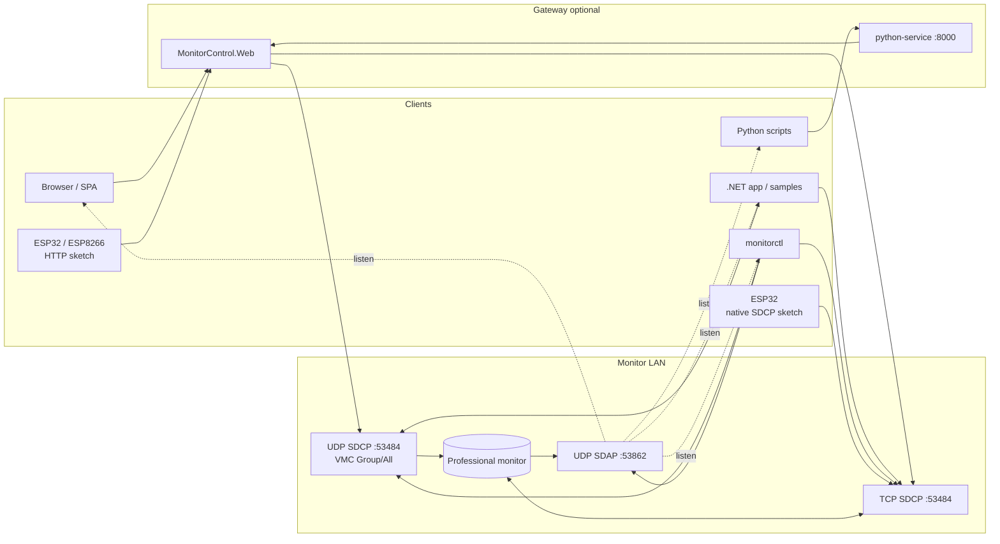

## Python gateway: what is proxied

[`examples/python-service/main.py`](../../examples/python-service/main.py) registers **`/api/{full_path:path}`** only. Static UI is served from Python; API calls go to `MONITOR_CONTROL_API_URL` (default `http://127.0.0.1:5080`).

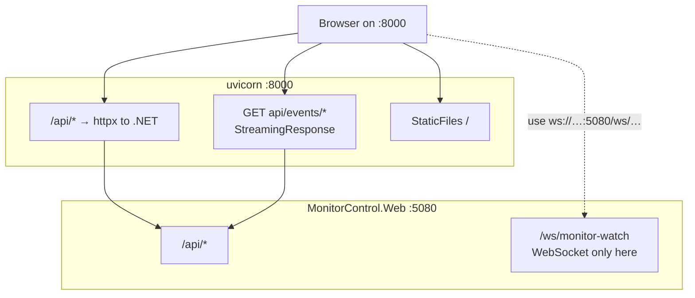

**WebSocket clients** must use the **same host and port as the ASP.NET process** (for example `ws://127.0.0.1:5080/ws/monitor-watch?host=…`), not the Python port **8000**.

## Discovery vs control traffic

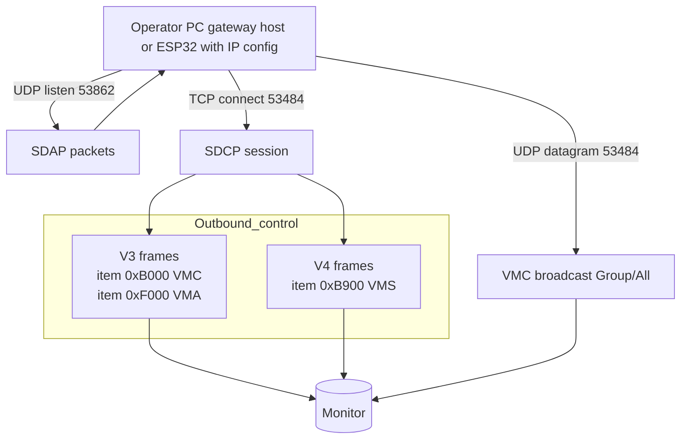

The **ESP32 native sketch** does not run an SDAP listener; you set `MONITOR_HOST` to the monitor’s IP (often learned once from SDAP on a PC).

## VMC over TCP: C# / web host (reference)

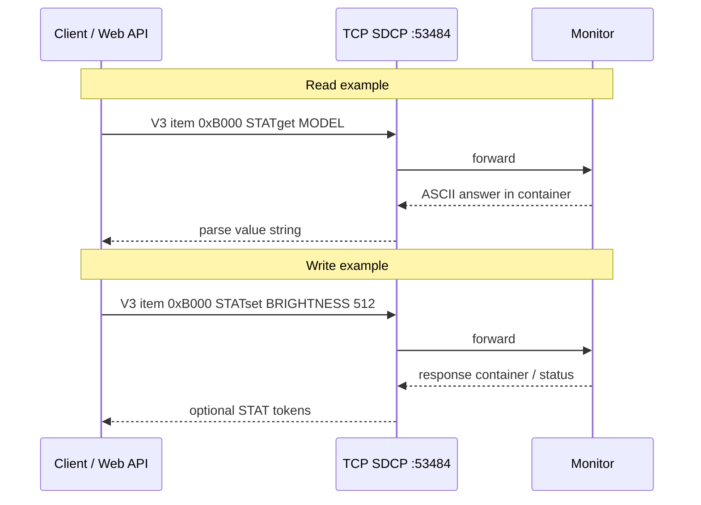

## VMC over TCP: ESP32 native (`monitor_knobs_sdcp.ino`)

Same wire as above: **13-byte SDCP v3 header** (`version=3`, `category=11`, `SONY`, single-target bytes **6–7 = 0**, request **8 = 0**, item **9–10 = 0xB000** BE, data length **11–12** BE) then **ASCII** (`STATset …` / `STATget …`). The sketch builds this in `buildVmcPacket` / `buildVmcStatSetTail`, sends with `WiFiClient::write`, reads until timeout or buffer full, and treats **`rx[8] == 1`** as response OK (aligned with `SDCP_COMMAND_RESPONSE_OK` in [`SdcpMessageBuffer`](../../src/MonitorControlSDK/Protocol/SdcpMessageBuffer.cs)).

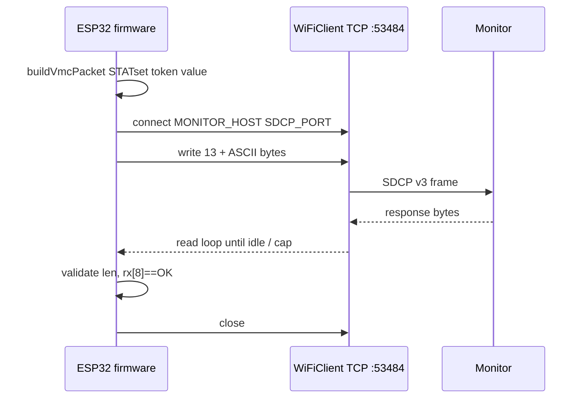

## ESP32 native: operator modes (runtime)

Short press **MODE** cycles **PICTURE** → **RGB_GAIN** → **GRADE** (see sketch `RunMode` and README table). ADC mapping and NVS keys differ per mode.

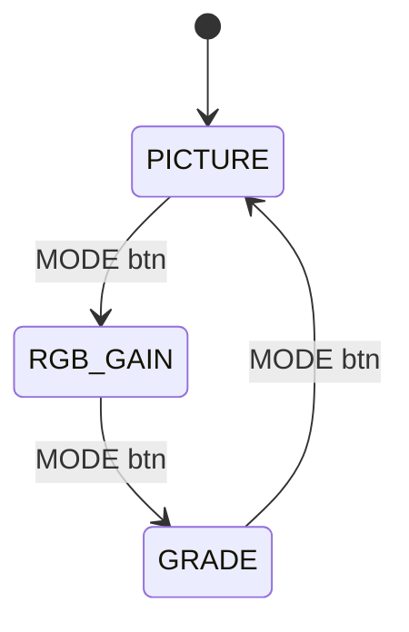

## HTTP path: JSON to monitor (short-lived TCP on server)

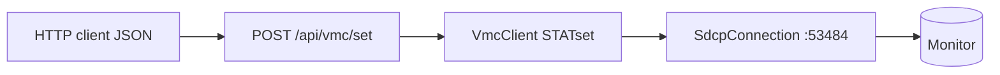

`POST /api/vmc/broadcast` is **UDP** only (`VmcUdpBroadcastClient`); no TCP session to `host`.

## MonitorControl.Web route surface (REST + push)

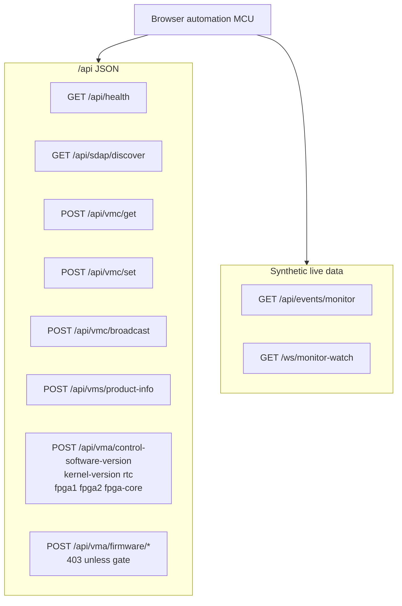

## CLI (`monitorctl`) to transport

| Command | Maps to |
|---------|---------|
| `discover` | `SdapDiscovery` UDP **53862** |
| `vmc` | TCP **53484** `STATget` |
| `vmc-broadcast` | UDP **53484** `VmcUdpBroadcastClient` |
| `vms-info` | TCP **53484** VMS |
| `vma-version` | TCP **53484** VMA read |

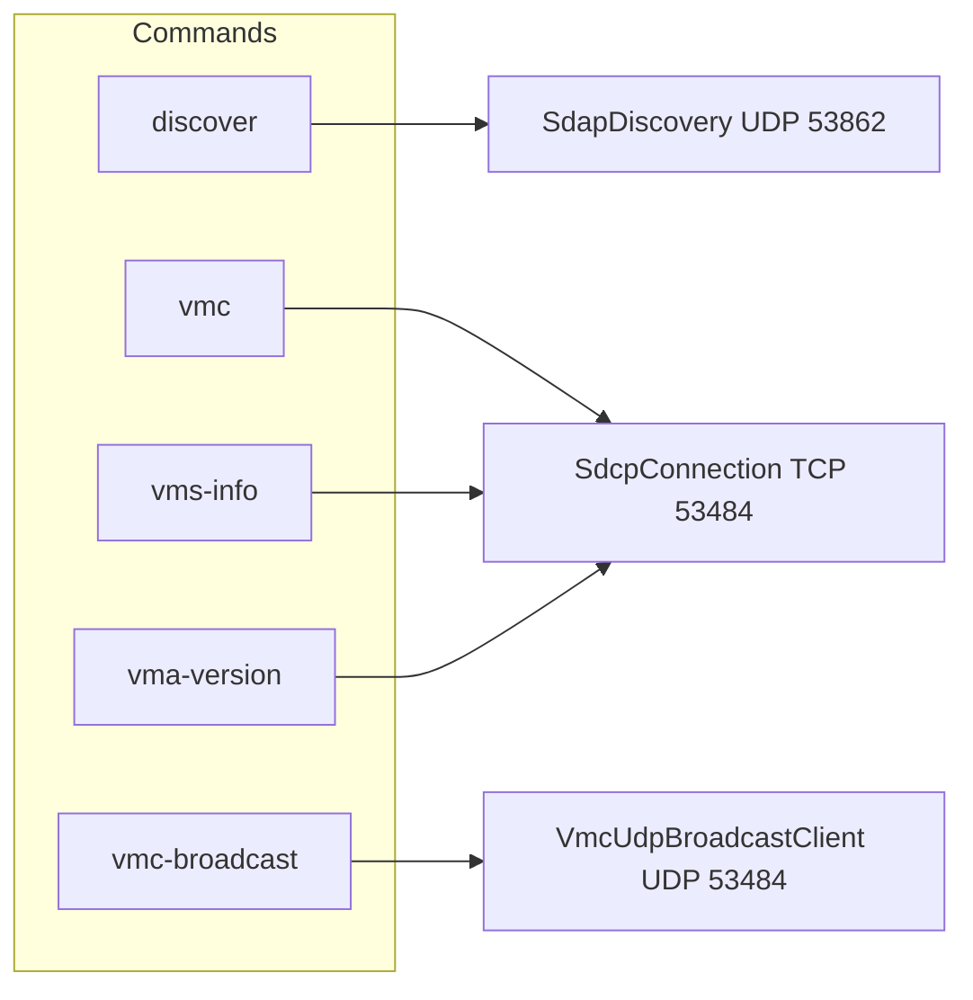

## Physical UI: HTTP gateway vs native SDCP on ESP32

Both examples use **ADC + optional buttons**; only the **last hop** differs.

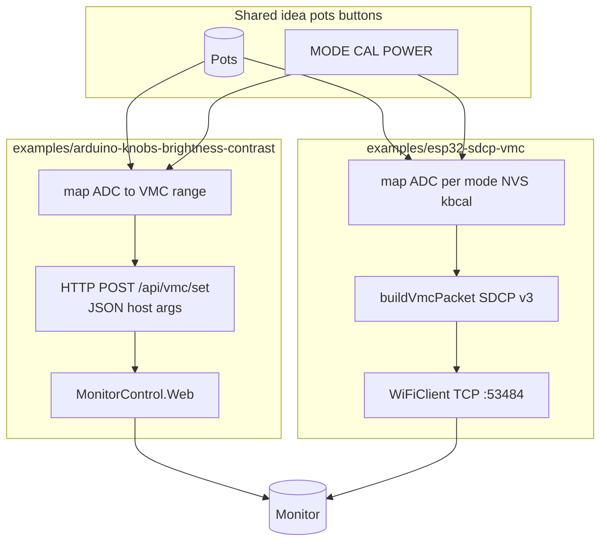

## Server-push shape (SSE / WebSocket)

The monitor only speaks **SDCP**. SSE and WebSocket **poll `STATget`** on the server and stream JSON.

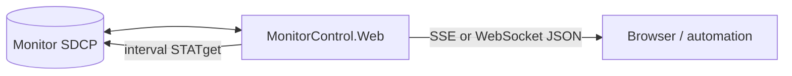

## Long-lived TCP: `Sample.BroadcastControl` REPL

One TCP session for many `get` / `set` lines — spec: [broadcast-realtime-control.md](../spec/broadcast-realtime-control.md).

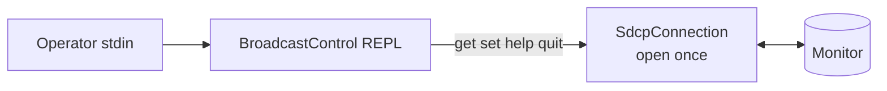

## SDK layering (library)

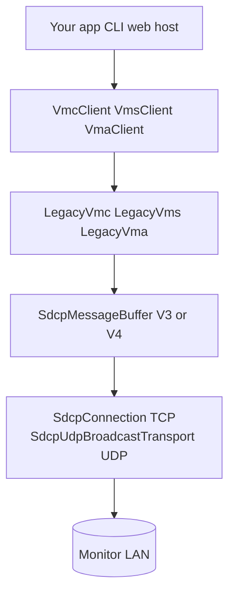

## Related

- [Engineering handbook](../handbook.md) — trust boundaries, reading order.
- [Web API guide](../guide/web-api-and-python-gateway.md) — bodies, firmware gate, push.
- [spec/broadcast-realtime-control.md](../spec/broadcast-realtime-control.md) — REPL grammar.
- [spec/vmc-string-catalog.md](../spec/vmc-string-catalog.md) — VMC doc index.
- [examples/README.md](../../examples/README.md) — catalog of non-.NET examples.
- [samples/README.md](../../samples/README.md) — .NET samples.
