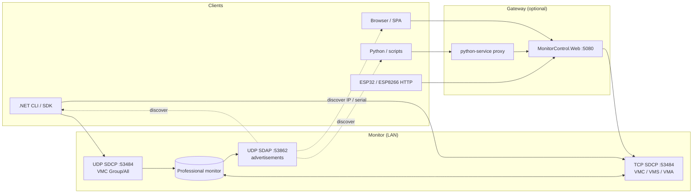
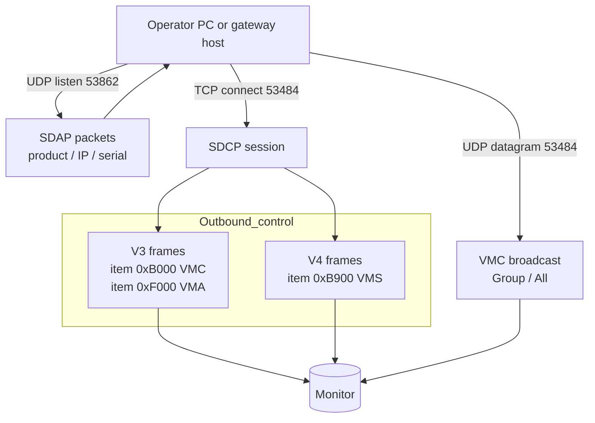
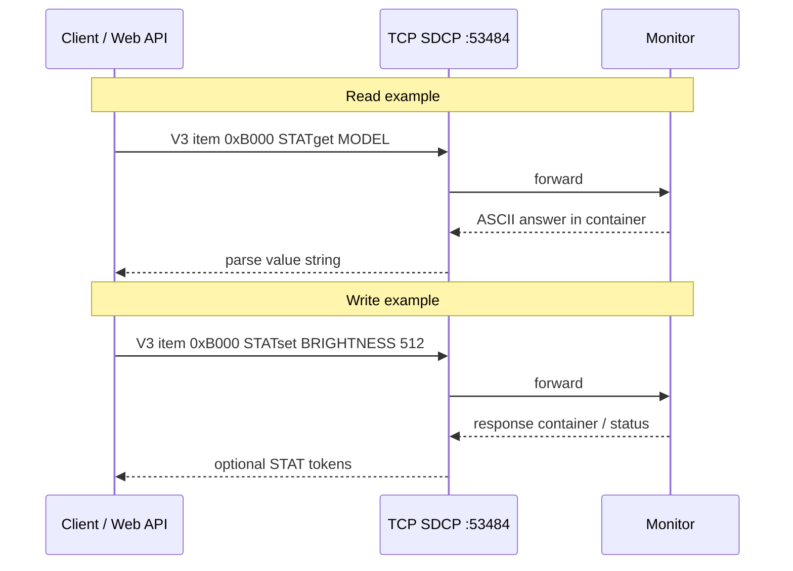
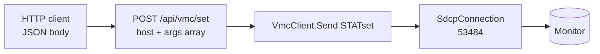
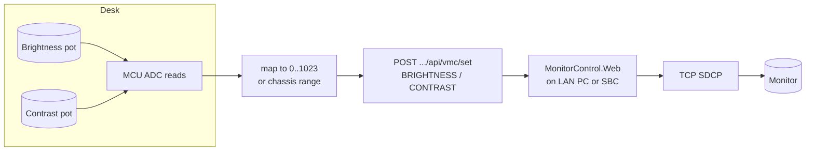
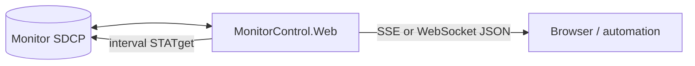

# Monitor control flows (Mermaid)

High-level views of **where data moves** and **how common picture controls** reach the monitor. Ports and item numbers match [SDCP framing and item numbers](../reference/sdcp-framing-and-items.md).

## End-to-end stacks

Two common integration shapes: **direct SDCP** from a PC or embedded device that speaks the wire protocol, or **HTTP JSON** through [MonitorControl.Web](../../src/MonitorControl.Web/) (same SDCP underneath).

## Discovery vs control traffic

## VMC: reads and writes (picture and identity)

`STATget` returns ASCII; `STATset` carries tokens such as `BRIGHTNESS`, `CONTRAST`, `MODEL` (model-dependent). See [VMC command surface](../reference/vmc-command-surface.md).

## HTTP path: browser or MCU to monitor

The web host opens a **short-lived SDCP connection** per request, runs `VmcClient`, then closes TCP.

## Local controls: knobs to brightness / contrast

Physical pots on ADC pins → firmware maps to numeric range → **HTTP** to the gateway (recommended on MCUs) or raw SDCP if you port the framing.

## Server-push shape (SSE / WebSocket)

The monitor speaks **SDCP request/response** only. “Push” in `MonitorControl.Web` is implemented by **server-side polling** of `STATget` and streaming JSON to browsers or tools.

## Related

- [Web API guide](../guide/web-api-and-python-gateway.md) — route table, SSE/WebSocket, firmware gate.
- [OpenAPI codegen](../guide/openapi-codegen.md) — fetch `swagger.json`, generate C client.
- HTTP knobs: [`examples/arduino-knobs-brightness-contrast/`](../../examples/arduino-knobs-brightness-contrast/).
- Native SDCP knobs: [`examples/esp32-sdcp-vmc/`](../../examples/esp32-sdcp-vmc/).
